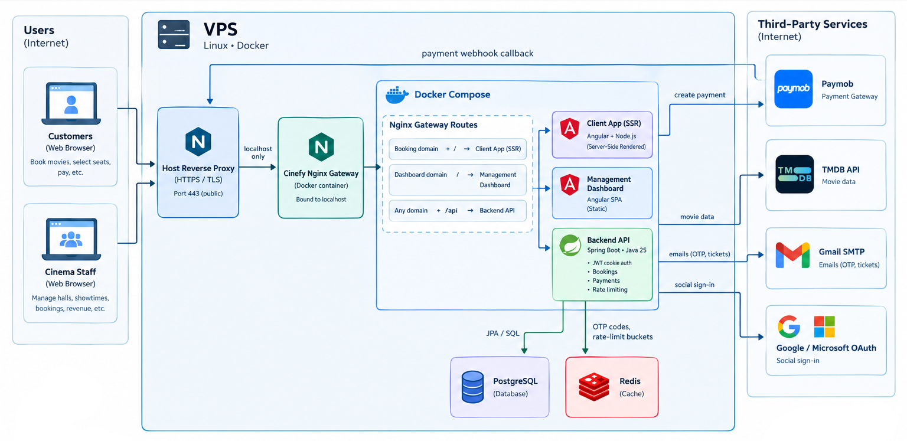

# Cinefy

**Cinefy is an open-source platform for running a cinema and selling its tickets online.**

It has two web apps that share one backend:

- **Cinefy** is the public booking site. Moviegoers browse what's showing, pick seats, pay online, and receive an e-ticket.
- **Cinefy Management** is the staff dashboard. Cinema staff use it to set up halls, schedule showtimes, sell and check tickets, manage the team, and follow sales.

---

## Table of contents

- [Architecture](#architecture)
- [Features](#features)
- [Tech stack](#tech-stack)
- [Repository structure](#repository-structure)
- [Getting started](#getting-started)
- [Deployment](#deployment)
- [Contributing](#contributing)
- [Acknowledgements](#acknowledgements)

---

## Architecture

<!--
  ARCHITECTURE DIAGRAM PLACEHOLDER
  Replace the blockquote below with the final image, for example:

  <p align="center">
    
  </p>
-->

> 🖼️ **Architecture diagram coming soon.**

The system is made of these parts:

| Component             | Role                                                                                                  |
| --------------------- | ----------------------------------------------------------------------------------------------------- |
| **Nginx**             | The single entry point. It serves both web apps and routes API requests to the backend.               |
| **Client app**        | The public booking site for moviegoers. Public pages are rendered on the server so they load quickly. |
| **Management app**    | The dashboard used by cinema staff.                                                                   |
| **Shared UI library** | Components both apps share, such as the seat map, dialogs and form controls.                          |
| **Backend API**       | Holds all the business logic: bookings, payments, accounts, scheduling and reports.                   |
| **PostgreSQL**        | The main database. It also keeps a history of changes to records.                                     |
| **TMDB**              | Supplies movie information: titles, posters, cast and trailers.                                       |
| **Paymob**            | The payment gateway. Customers pay on Paymob's secure checkout page.                                  |

---

## Features

### For moviegoers

- **Browse movies.** The home page has featured movies, a _Now showing_ row and a _Coming soon_ row. The catalog can be searched by title and filtered by experience (Standard, IMAX, etc.), genre and age rating.
- **Movie details.** Each movie has its cast, directors, trailer and the available showtimes for each day.
- **Choose seats.** An interactive seat map shows Normal and VIP seats, their prices and which seats are already taken. Chosen seats are held for 10 minutes while the customer pays.
- **Pay online.** Customers pay by card on a secure checkout page and can save their card for next time.
- **E-tickets.** Each confirmed booking gets a ticket with a QR code, which is also sent by email.
- **Accounts:**
  - Sign up with email and password, or sign in with an OAuth provider
  - Reset a forgotten password
  - Edit the profile and manage saved cards
  - See booking history and bookings still in progress

### For cinema staff

- **Roles.** Staff are Admins, Managers, Cashiers or Ushers, and each role sees only the pages and actions it needs.
- **Halls:**
  - Design each hall's seating with a visual editor: Normal and VIP seats, aisles, and seats sold only at the box office.
  - Set ticket prices per seat category.
  - Group halls by experience (Standard, IMAX, etc.).
  - Mark halls as active, scheduled, under maintenance or inactive.
- **Movies and showtimes:**
  - Find movies from the TMDB catalog and schedule showtimes in any hall.
  - Prepare showtimes as drafts and publish them when ready.
  - Feature a movie on the booking site's home page.
  - Announce upcoming movies to customers.
- **Box office:**
  - Sell tickets at the counter for cash or card, and print the ticket.
  - Check tickets at the door with a barcode scanner or by typing the booking reference.
- **Statistics.** Sales, revenue, refunds, tickets sold and hall occupancy for any date range, compared with the previous period, plus a ranking of the best-performing movies.
- **Payments.** Set up the payment gateway from the dashboard, with no config files or redeploys needed.
- **Staff.** Manage the team's roles, schedules and working hours, and see who is on shift right now.

### Under the hood

- **No double bookings.** A seat can be held or sold to only one person at a time. Unpaid holds expire and the seats return to sale automatically.
- **Secure accounts.** Staff and customers sign in separately, sessions are protected against common web attacks, and payment credentials are encrypted.
- **Change history.** Changes to records are tracked.
- **Automatic upkeep.** Showtime statuses update by themselves, and movie information is refreshed from TMDB every day.
- **API documentation.** Interactive Swagger documentation of every endpoint.

---

## Tech stack

| Area                  | Technologies                                                                            |
| --------------------- | --------------------------------------------------------------------------------------- |
| **Backend**           | Java 25, Spring Boot 4, Spring Security, Spring Data JPA, Hibernate Envers, Maven       |
| **Database**          | PostgreSQL                                                                              |
| **Frontend**          | Angular 22 (with server-side rendering for the client app), PrimeNG, Lucide icons, SCSS |
| **Infrastructure**    | Docker, Docker Compose, Nginx, GitHub Actions                                           |
| **External services** | TMDB, Paymob, Gmail SMTP, OAuth providers                                               |

---

## Repository structure

```
Cinefy/
├── cinefy-backend/           # Backend API (Spring Boot)
├── cinefy-frontend/          # Frontend workspace (pnpm)
│   ├── cinefy-client/        # Public booking site
│   ├── cinefy-management/    # Staff dashboard
│   └── cinefy-ui/            # Shared UI library
├── .github/workflows/        # CI/CD pipelines
├── docker-compose.yml        # Production stack
└── .env.example              # Environment variables for the production stack
```

Each package has its own README with the details for working on it: [backend](cinefy-backend/README.md), [booking site](cinefy-frontend/cinefy-client/README.md), [staff dashboard](cinefy-frontend/cinefy-management/README.md), [shared UI library](cinefy-frontend/cinefy-ui/README.md).

---

## Getting started

### Prerequisites

- **Java 25**
- **Node.js 24**
- **pnpm 12** (run `corepack enable` to use the version pinned in the repo)
- **PostgreSQL**

You'll also need credentials for these services:

| Service                                                                                 | Used for                                          |
| --------------------------------------------------------------------------------------- | ------------------------------------------------- |
| [TMDB](https://www.themoviedb.org/settings/api) API read access token                   | Movie information                                 |
| Gmail account with an [app password](https://support.google.com/accounts/answer/185833) | Sending emails                                    |
| OAuth provider apps                                                                     | Customer social sign-in                           |
| [Paymob](https://paymob.com) merchant account                                           | Online payments (set up later from the dashboard) |

### 1. Backend

Create an empty PostgreSQL database, then create `cinefy-backend/src/main/resources/application-local.yml` with your settings. The [backend README](cinefy-backend/README.md#configuration) has a ready-to-fill template.

Start the backend:

```bash
cd cinefy-backend
./mvnw spring-boot:run -Dspring-boot.run.profiles=local
```

The API runs at **http://localhost:8080**, and its documentation is at **http://localhost:8080/docs/swagger-ui.html**.

### 2. Frontend

> Run all pnpm commands from the `cinefy-frontend/` folder, not from inside the individual apps.

```bash
cd cinefy-frontend
pnpm install
pnpm ui:build                   # build the shared UI library first

pnpm client:dev                 # booking site    → http://localhost:4200
pnpm mgmt:dev --port 4201       # staff dashboard → http://localhost:4201
```

Sign in to the dashboard with the admin account from your config file. From there you can create halls, schedule showtimes and set up payments.

---

## Deployment

Cinefy runs as four Docker containers: the backend, the two web apps and an Nginx proxy in front of them. [`docker-compose.yml`](docker-compose.yml) starts the whole stack and connects to an external PostgreSQL database. To configure it, copy [`.env.example`](.env.example) to `.env` and fill in the values.

GitHub Actions builds every pull request. A separate workflow scans the images for vulnerabilities, publishes them to Docker Hub and deploys them.

---

## Contributing

Contributions are welcome: bug reports, feature ideas and pull requests.

1. Create a branch from `main` (fork the repository first if you don't have write access).
2. Make your change and check that it builds:
   - Backend: `./mvnw compile` (from `cinefy-backend/`)
   - Frontend: `pnpm app:build` (from `cinefy-frontend/`)
3. Open a pull request explaining what changed and why.

---

## Acknowledgements

- Movie data and images are provided by [TMDB](https://www.themoviedb.org/). This product uses the TMDB API but is not endorsed or certified by TMDB.
- UI components are built on [PrimeNG](https://primeng.org/), and icons come from [Lucide](https://lucide.dev/).
